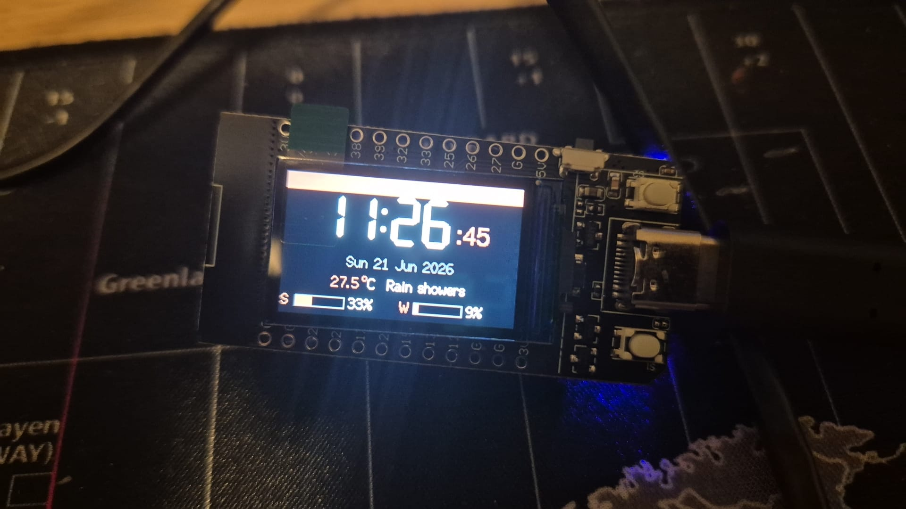
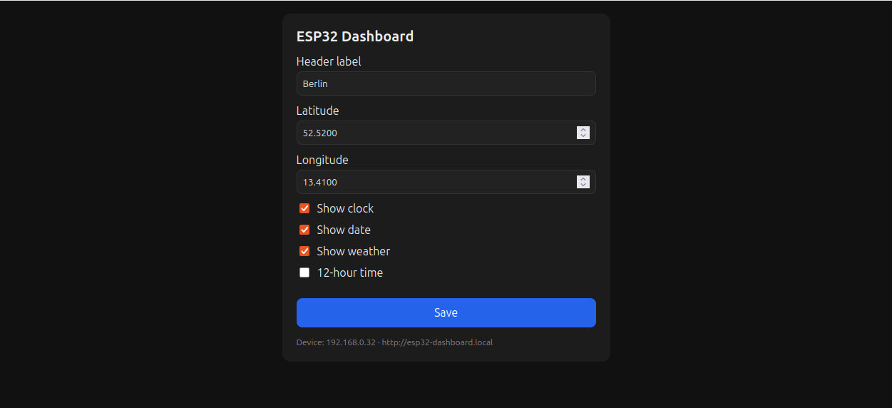

# ESP32 Display Dashboard

[](LICENSE)
[](https://www.espressif.com/en/products/socs/esp32)
[](https://platformio.org/)

A tiny LAN dashboard running on an **ESP32 board with a 1.14" ST7789 IPS display**.
The screen shows at-a-glance info; a small web page served by the device (on the local
network) lets you configure what's displayed.

## Features

- 🕐 **Local date & time** — NTP-synced, timezone-aware (defaults to Berlin; configurable).
- 🌤️ **Current weather** — via [Open-Meteo](https://open-meteo.com) (no API key needed).
- 📊 **Claude usage** — your subscription session/weekly limits as on-screen gauges, fed by
  a tiny local helper (see [helper/README.md](helper/README.md)). Fully optional.
- ⚙️ **Web config page** — set location, header label, and toggle widgets from any browser
  on your LAN (`http://esp32-dashboard.local`). Settings persist across reboots.
- 🎨 Styled with Anthropic's published color palette.

> **Privacy note:** the device only talks to your LAN and public weather/NTP servers. It
> never sees your Anthropic credentials — the usage helper runs on your own machine and
> exposes only two percentages. WiFi credentials live in a gitignored `secrets.h`.

## Screenshots

| On the device | Web config page |
|---|---|
|  |  |

The screen shows the time, date, weather, and two gauges — **S** (5-hour session limit) and
**W** (7-day weekly limit) — fed by the optional local helper. The config page is reachable
at `http://esp32-dashboard.local` from any browser on the same network.

For full hardware details and the confirmed pinout, see **[docs/HARDWARE.md](docs/HARDWARE.md)**.

## Hardware (short version)

- ESP32-WROOM-32 + 1.14" ST7789 (135×240) IPS display — a LilyGO T-Display clone
- USB-C, **CH9102** USB-serial chip → appears as **`/dev/ttyACM0`** (not `ttyUSB0`)
- No touchscreen — interaction is via the web page (the ST7789 is display-only)
- The exact unit this was built on: [AliExpress listing 1005009890213912](https://de.aliexpress.com/item/1005009890213912.html) (TENSTAR ROBOT). Clones vary — verify your pinout against [docs/HARDWARE.md](docs/HARDWARE.md).
- See [docs/HARDWARE.md](docs/HARDWARE.md) for the full confirmed pin map.

## Toolchain

- **PlatformIO Core** (Arduino framework) — installed at `~/.platformio/penv/bin/pio`
- **TFT_eSPI** library for the display (configured via `build_flags` in `platformio.ini`)

### One-time machine setup
1. Install the **PlatformIO IDE** VSCode extension (also installs the CLI core).
2. Add yourself to the serial group, then **reboot**:
   ```bash
   sudo usermod -aG dialout $USER
   ```
3. Create your WiFi secrets file from the template and fill in real values:
   ```bash
   cp include/secrets.example.h include/secrets.h
   # then edit include/secrets.h — it is gitignored and never committed
   ```

## Build / Flash / Monitor

```bash
PIO=~/.platformio/penv/bin/pio

$PIO run                 # build
$PIO run -t upload       # build + flash to /dev/ttyACM0
```

> **Reading serial output:** `pio device monitor` needs an interactive TTY and fails in
> non-interactive shells. Use this pyserial snippet instead:
> ```bash
> ~/.platformio/penv/bin/python - <<'PY'
> import serial, time
> s = serial.Serial('/dev/ttyACM0', 115200, timeout=1)
> s.setDTR(False); s.setRTS(True); time.sleep(0.1); s.setRTS(False); time.sleep(0.1)
> s.reset_input_buffer()
> end = time.time() + 6
> while time.time() < end:
>     line = s.readline().decode(errors='replace').rstrip()
>     if line: print(line)
> s.close()
> PY
> ```
> In the VSCode PlatformIO UI, the serial monitor button works fine interactively.

## Roadmap

| Stage | Goal | Status |
|---|---|---|
| 0 | Dev environment (PlatformIO, serial access) | ✅ Done |
| 1 | Display brings up text + colors | ✅ Done |
| 2 | Connect to WiFi, show IP on screen | ✅ Done |
| 3 | Berlin date & time (NTP + timezone) | ✅ Done |
| 4 | Current weather (Open-Meteo, no API key) | ✅ Done |
| 5 | Web config page on the LAN | ✅ Done |
| 6 | Claude usage (via a small helper/proxy) | ✅ Done |

**All stages complete.** 🎉 The usage widget needs the local helper running — see [helper/README.md](helper/README.md).

Each stage is tested on real hardware before moving on.

## Project layout

```
platformio.ini        # board, TFT_eSPI pins, build flags (versions pinned)
src/main.cpp          # current firmware
docs/HARDWARE.md      # confirmed hardware reference + pinout
docs/STACK.md         # pinned versions, decisions & sources to consult
docs/datasheets/      # official component datasheets
helper/               # local Claude-usage helper (Python HTTP service)
.claude/skills/       # reusable project skills (build, display, data sources)
CLAUDE.md             # orientation notes for AI sessions
```

## Contributing

This board is a LilyGO T-Display clone; pins and quirks can vary between clones. If
yours differs, the confirmed-vs-unverified hardware notes in [docs/HARDWARE.md](docs/HARDWARE.md)
and the pinned toolchain in [docs/STACK.md](docs/STACK.md) are the place to start. PRs
with other boards' working pin maps are welcome.

## License

This project is licensed under the **[MIT License](LICENSE)** — free to use, modify, and
share, including commercially, provided the copyright notice is retained.

### Third-party components

This project builds on the following, each under its own license:

| Component | License | Used for |
|---|---|---|
| [Arduino-ESP32 core](https://github.com/espressif/arduino-esp32) | LGPL-2.1 / Apache-2.0 | WiFi, web server, NVS, NTP, mDNS |
| [TFT_eSPI](https://github.com/Bodmer/TFT_eSPI) | FreeBSD (BSD-2-Clause-like) | ST7789 display driver |
| [ArduinoJson](https://github.com/bblanchon/ArduinoJson) | MIT | parsing weather / usage JSON |
| [Open-Meteo](https://open-meteo.com) | CC BY 4.0 (data) | weather data (no API key) |

Datasheets under `docs/datasheets/` are © their respective manufacturers (Espressif,
Sitronix) and are included for reference only.

### Trademark note

The on-screen styling reuses **color values** from Anthropic's published brand palette.
Colors are not copyrightable; no Anthropic logo, wordmark, or "Claude" mark is reproduced.
This project is **not affiliated with, sponsored by, or endorsed by Anthropic**.
